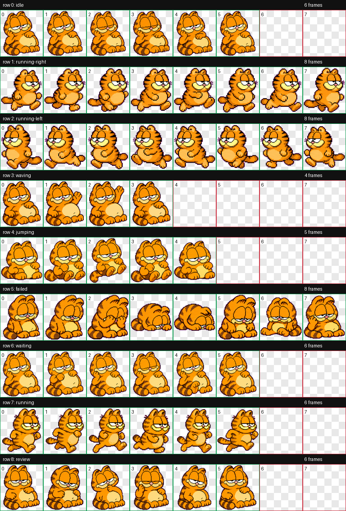

# Codex Pets

Custom pet packages for the Codex desktop app.

## Quick Install

```bash
git clone https://github.com/kelvinLLL/Codex-Pets.git
cd Codex-Pets
./scripts/install-pet.sh marmalade
```

Restart Codex after installation, then choose `Marmalade` from the pet or appearance settings.

## Manual Install

If you do not want to run the helper script:

```bash
git clone https://github.com/kelvinLLL/Codex-Pets.git
mkdir -p "${CODEX_HOME:-$HOME/.codex}/pets"
cp -R Codex-Pets/pets/marmalade "${CODEX_HOME:-$HOME/.codex}/pets/"
```

The installed folder should contain:

```text
${CODEX_HOME:-$HOME/.codex}/pets/marmalade/
  pet.json
  spritesheet.webp
```

## Pets

| Pet | Description | Package | Preview |
| --- | --- | --- | --- |
| Marmalade | A lazy orange tabby companion with heavy-lidded charm, snack-first priorities, and deadpan nap energy. | `pets/marmalade` | `previews/marmalade/contact-sheet.png` |



## Repository Layout

```text
pets/
  marmalade/
    pet.json
    spritesheet.webp
previews/
  marmalade/
    contact-sheet.png
    review.json
    run-summary.json
    videos/*.mp4
docs/
  quick-start.md
  pet-format.md
scripts/
  install-pet.sh
```

## Notes

- These are custom fan-made/generated Codex pet assets, not official Codex built-ins.
- Restart Codex if a newly installed pet does not appear immediately.
- Keep `pet.json` and `spritesheet.webp` together in the same pet folder.
